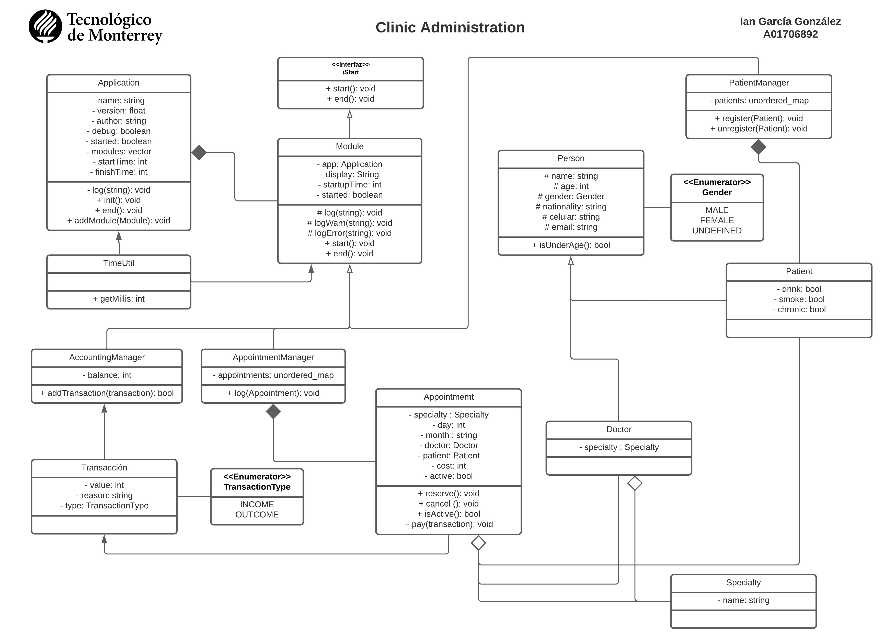

<a href="#">
    
</a>

# Clinic Administration 🏥

#### TC1030
_Proyecto para la materia de POO, en C++._

### Contexto 🔍

Este programa escrito en C++ 11 trata de poder facilitar el registro de pacientes, consultas y contabilidad de una clínica médica por medio de registros e historial de los mismos. Al ser una versión inicial no cuenta con una interfaz (GUI), sin embargo el programa es completamente funcional. Este software tiene bastante capacidad para expandirse por lo que cualquiera es libre de modificar/agregar cosas siguiendo los términos de la [licencia](LICENSE.md). 

### Pre-requisitos 📋

* C++ 11.
* _Git_ en caso de querer clonar el repositorio.

### Instalación 🔧

_Clonar repositorio o descargar código fuente._

```shell
    git clone https://github.com/iangg29/Clinic-Administration
```

_Ir al proyecto descargado_

```shell
    cd Clinic-Administration
```

_Compilar programa_

```shell
    g++ -std=c++11 main.cpp
```

_Ejecutar_

- **LINUX/MACOS**
```shell
    ./a.out
```
- **WINDOWS**
```shell
    a.exe
```

## Diagrama UML 🧭

<p align="center">
    
</p>

Ver [UML.jpeg](UML.jpeg)

## Construido con 🛠️

* [C++](https://en.wikipedia.org/wiki/C%2B%2B)

## Autor ✒️

* **Ian García** - [iangg29](https://github.com/iangg29)

## Referencias 📃

CPlusPlus (2020) vector. https://www.cplusplus.com/reference/vector/vector/

## Licencia 📄

Este proyecto está bajo la Licencia (GNU General Public License v3.0) - mira el archivo [LICENSE.md](LICENSE.md) para detalles

---
Ian García 2021
