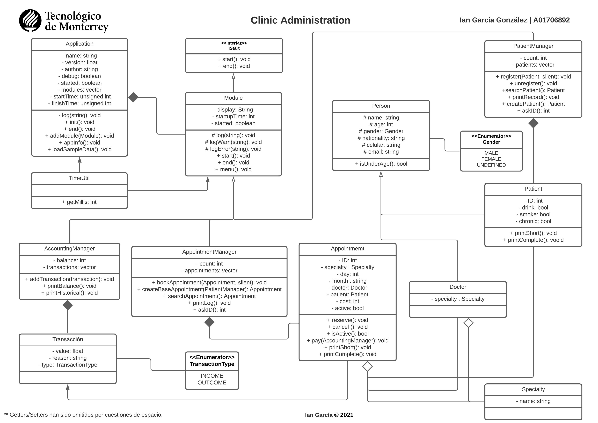

<a href="#">
    
</a>

# Clinic Administration 🏥

#### TC1030
_Proyecto para la materia de POO, en C++._

### Pre-requisitos 📋

* C++ 11.
* _Git_ en caso de querer clonar el repositorio.

### Instalación 🔧

_Clonar repositorio o descargar código fuente._

```shell
    git clone https://github.com/iangg29/Clinic-Administration
```

_Ir al proyecto descargado_

```shell
    cd Clinic-Administration
```

_Compilar programa_

```shell
    g++ main.cpp
```

_Ejecutar_

- **LINUX/MACOS**
```shell
    ./a.out
```
- **WINDOWS**
```shell
    a.exe
```

## Diagrama UML

<p align="center">
    
</p>

Ver [UML.jpeg](UML.jpeg)

## Construido con 🛠️

* [C++](https://en.wikipedia.org/wiki/C%2B%2B)

## Autor ✒️

* **Ian García** - [iangg29](https://github.com/iangg29)

## Referencias 📃

CPlusPlus (2020) unordered_map. https://www.cplusplus.com/reference/unordered_map/unordered_map/

## Licencia 📄

Este proyecto está bajo la Licencia (GNU General Public License v3.0) - mira el archivo [LICENSE.md](LICENSE.md) para detalles

---
Ian García 2021
